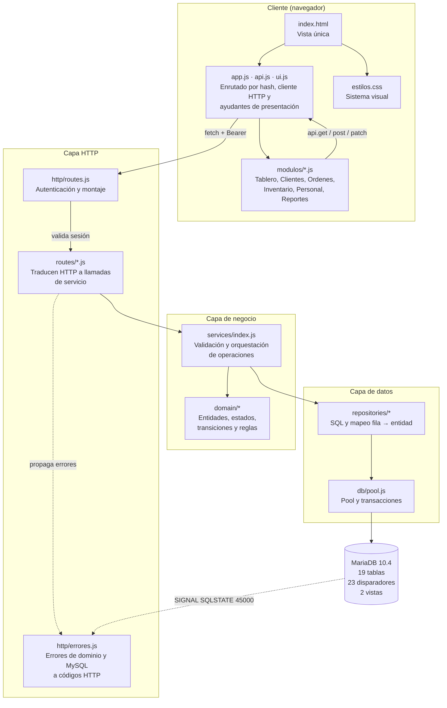
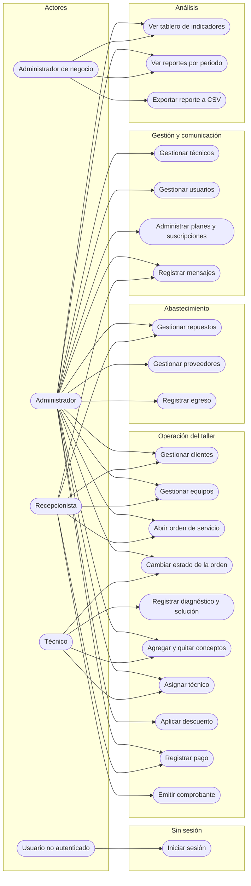
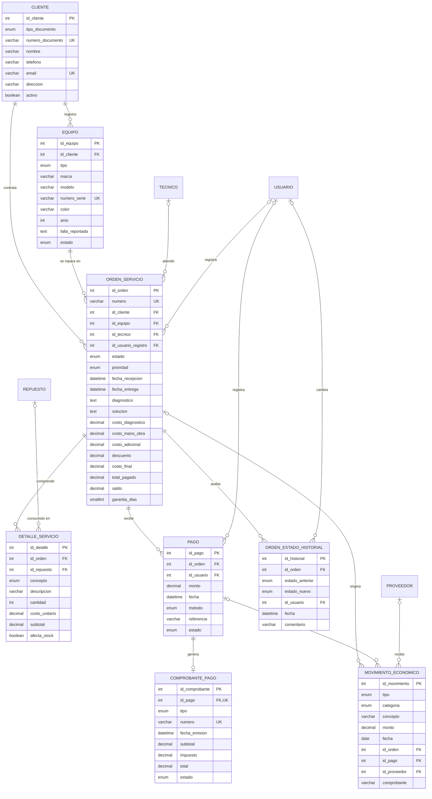
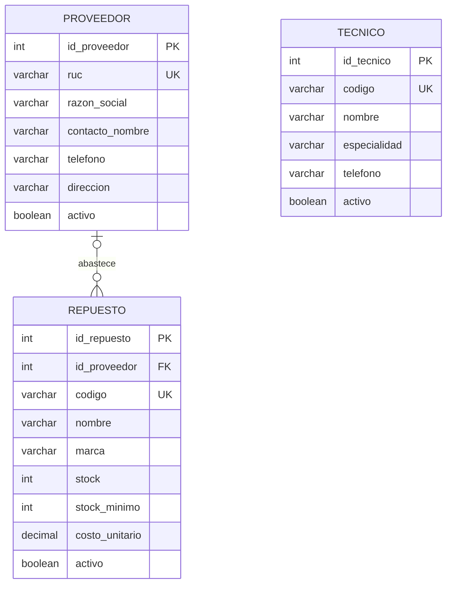
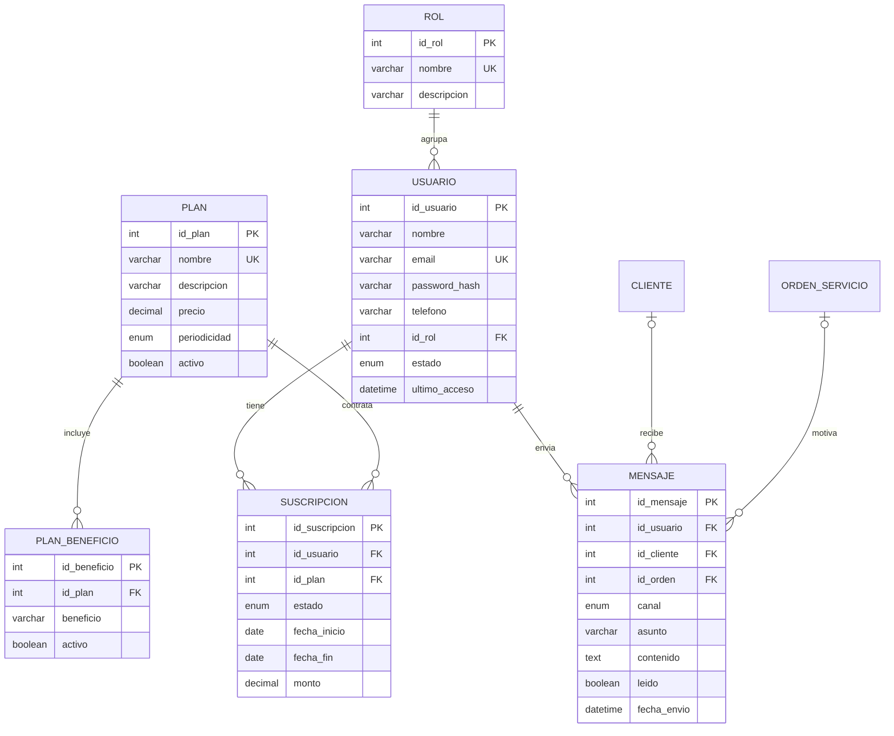
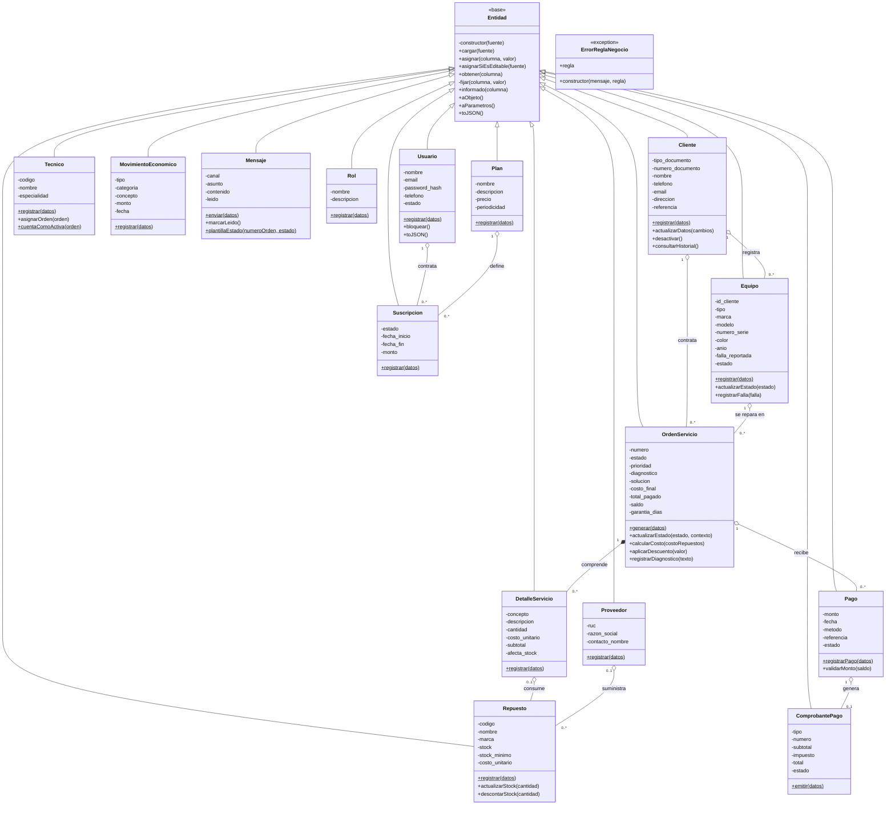
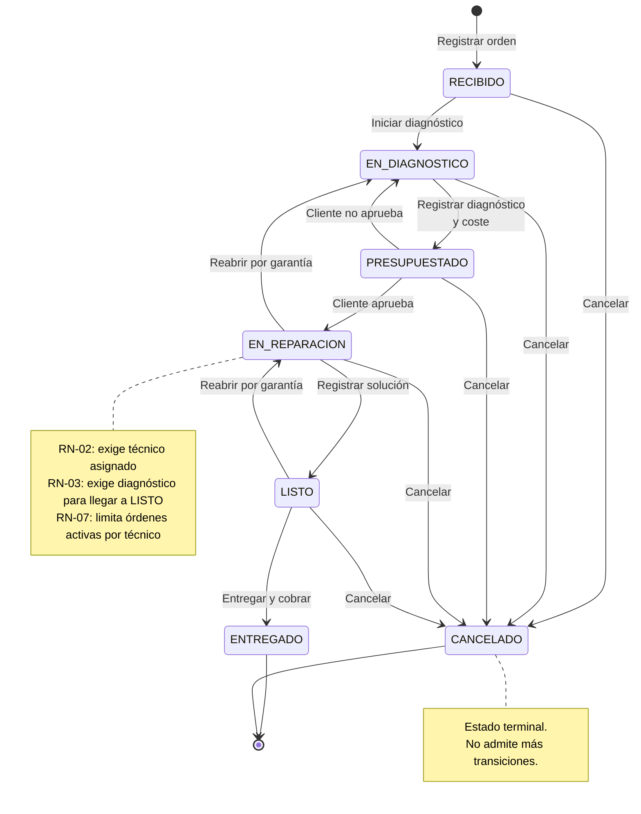
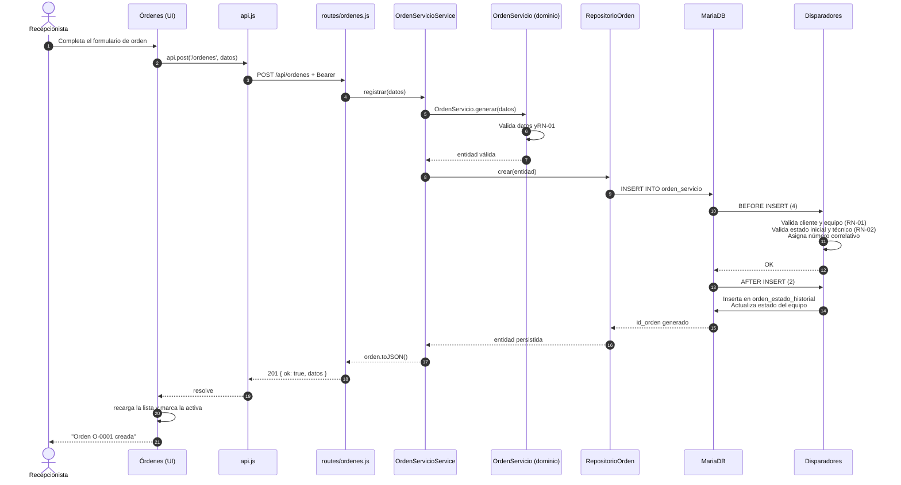

# Sistema de Gestión Integral para una Empresa de Reparación de Celulares y Equipos Tecnológicos

Aplicación web para administrar el circuito completo de un taller de reparación
de dispositivos: desde el ingreso del equipo hasta la entrega y el cobro,
incluyendo diagnóstico, control de repuestos, asignación de técnicos e
indicadores de gestión.

Desarrollada como práctica de **Análisis Orientado a Objetos (POO)**. La lógica
de negocio está modelada en clases del dominio y reforzada con disparadores
(triggers) en la base de datos, de modo que las reglas se respetan incluso si
alguien escribe directamente en el motor.

---

## Tabla de contenidos

1. [Descripción general](#1-descripción-general)
2. [Problema y solución](#2-problema-y-solución)
3. [Objetivos del proyecto](#3-objetivos-del-proyecto)
4. [Funcionalidades del sistema](#4-funcionalidades-del-sistema)
5. [Tecnologías utilizadas](#5-tecnologías-utilizadas)
6. [Arquitectura y estructura de carpetas](#6-arquitectura-y-estructura-de-carpetas)
7. [Diagramas técnicos](#7-diagramas-técnicos)
8. [Requisitos previos](#8-requisitos-previos)
9. [Instalación y configuración](#9-instalación-y-configuración)
10. [Ejecución del sistema](#10-ejecución-del-sistema)
11. [Base de datos](#11-base-de-datos)
12. [Flujo de trabajo](#12-flujo-de-trabajo)
13. [API REST](#13-api-rest)
14. [Seguridad y buenas prácticas](#14-seguridad-y-buenas-prácticas)
15. [Estado actual del proyecto](#15-estado-actual-del-proyecto)
16. [Posibles mejoras futuras](#16-posibles-mejoras-futuras)
17. [Autoría y licencia](#17-autoría-y-licencia)

---

## 1. Descripción general

### 1.1 Propósito

El sistema centraliza la información de un taller de reparación tecnológica y
sustituye el registro manual en cuadernos y hojas de cálculo por una aplicación
que sostiene la trazabilidad de cada equipo desde que ingresa hasta que se
entrega.

Está pensado para un taller pequeño o mediano que:

- recibe equipos a reparar —celular, tablet, laptop, computadora o impresora—;
- realiza diagnóstico técnico antes de comprometer trabajo;
- necesita controlar repuestos y proveedores porque las piezas limitan la
  capacidad de trabajo;
- cobra por adelantado, al entregar o combinando ambas formas;
- necesita saber si está ganando o perdiendo dinero, no solo cuánto facturó.

### 1.2 Qué problema resuelve

Un taller rara vez pierde dinero por falta de información de sus clientes.
Pierde dinero por **pérdida de control**: dispositivos que entran y no se
recuperan, repuestos que se consumen sin registrar, órdenes que quedan abiertas
en papel y cuentas por cobrar que nadie concilia.

El sistema atiende esa pérdida de control con tres mecanismos:

| Pérdida de control | Mecanismo del sistema |
|---|---|
| Órdenes que se pierden o se saltan etapas | Máquina de estados que solo admite transiciones válidas, validada en tres capas |
| Repuestos que desaparecen | El detalle de la orden descuenta stock automáticamente y deja rastro |
| Dinero que no se sabe quién debe | Saldo por orden calculado por el motor, con pagos y comprobantes |

---

## 2. Problema y solución

### 2.1 Necesidad

En el proceso habitual de un taller, la información de una orden está
repartida: la recepción anota el equipo en un cuaderno, el técnico escribe el
diagnóstico en papel, recepción cobra en la libreta y a fin de mes nadie sabe
cuánto se facturó realmente ni qué repuestos se consumieron.

Esto genera cuatro problemas concretos:

1. **Ambigüedad sobre el estado de un equipo.** El cliente pregunta si su
   teléfono está listo y nadie tiene una respuesta única y verificable.
2. **Pérdida de trazabilidad.** Sin historial de estados es imposible saber
   cuándo se recibió un equipo ni qué trabajo se le hizo.
3. **Descontrol del inventario.** Los repuestos se descuentan «en la cabeza»
   del técnico, lo que genera faltantes y compras de urgencia innecesarias.
4. **Imposibilidad de medir.** Sin datos consolidados no hay forma de evaluar al
   técnico, identificar los equipos que generan másprofit o detectar que el
   taller está trabajando con márgenes negativos.

### 2.2 Solución implementada

El sistema cubre las cuatro necesidades con los módulos descritos en la
sección 4. El elemento central es la **orden de servicio**: es el objeto que
concentra la información del cliente, del equipo, del técnico, del trabajo
realizado y de los cobros, y alrededor del cual gira la trazabilidad.

Tres decisiones de diseño sostienen la solución:

**La orden es una máquina de estados, no un campo de texto libre.** Cada orden
tiene un estado y solo puede avanzar por las transiciones permitidas. No se
puede marcar como `ENTREGADO` una orden sin técnico asignado, ni saltar de
`RECIBIDO` a `LISTO`.

**Las reglas viven en el motor, no solo en la aplicación.** Los 23 disparadores
del archivo `database/02_triggers.sql` aplican las siete reglas de negocio
(RN-01 a RN-07) en la base. Si alguien inserta o actualiza una orden con SQL
directo, el motor rechaza la operación.

**El stock y el saldo no los calcula la aplicación.** Los disparadores
descontan repuestos al confirmar el detalle y recalculan el saldo de la orden
con cada pago. La aplicación solo solicita la operación.

---

## 3. Objetivos del proyecto

### 3.1 Objetivo general

Desarrollar un sistema de gestión integral que permita a un taller de
reparación tecnológica organizar sus clientes, equipos, órdenes de servicio,
inventario de repuestos, personal técnico y cobros, garantizando la
trazabilidad de cada intervención y la fiabilidad de los indicadores de gestión.

### 3.2 Objetivos específicos

1. **Registrar y consultar clientes y equipos**, manteniendo el historial de
   cada equipo que el taller ha recibido.
2. **Controlar el ciclo de vida de la orden de servicio** mediante una máquina
   de estados que impida transiciones inválidas.
3. **Administrar el inventario de repuestos**, con descuento automático de
   existencias y alerta de reposición.
4. **Registrar los pagos y comprobantes** de cada orden, calculando el saldo
   pendiente.
5. **Asignar técnicos a las órdenes** respetando el límite de órdenes activas
   por técnico.
6. **Generar indicadores de gestión** que permitan evaluar la operación del
   taller y a sus técnicos.
7. **Controlar el acceso al sistema** mediante autenticación y cuatro perfiles
   de usuario.
8. **Aplicar los principios de POO** —encapsulamiento, herencia, abstracción y
   polimorfismo— en un modelo de dominio independiente de la capa de datos.

---

## 4. Funcionalidades del sistema

### 4.1 Tablero de indicadores

Consolida la operación del taller en una pantalla. Se alimenta de la vista
`v_indicadores`, que precalcula los totales para no recorrer las tablas en cada
consulta.

Presenta:

- **Órdenes totales** y su variación respecto al mes anterior.
- **Ingresos, egresos y margen** del periodo, con tendencia mensual.
- **Órdenes activas, equipos listos y cuentas por cobrar.**
- **Repuestos por reponer**, con el detalle de agotados sobre el catálogo total.
- **Distribución por estado** de las órdenes.
- **Ranking de técnicos** por órdenes atendidas.
- **Alertas**: mensajes sin leer y garantías próximas a vencer.
- **Acciones rápidas** hacia los módulos de registro.

El selector de periodo (7, 14 o 30 días; 14 por defecto) filtra los indicadores
mediante la URL `/api/reportes/tablero?dias=N`.

### 4.2 Clientes y equipos

Registro y trazabilidad de quién trae el equipo y de qué equipo se trata.

**Permite:**

- Registrar clientes con tipo y número de documento, contacto y dirección.
- Registrar equipos asociándolos a un cliente: tipo, marca, modelo, número de
  serie, color, año y falla reportada.
- Consultar el historial de órdenes de un cliente y el historial de un equipo.
- Editar los datos de un cliente existente.
- Dar de baja un equipo sin eliminar su historial.

El campo **marca** se alimenta de un catálogo de sugerencias, pero admite
escribir una marca nueva: el taller recibe equipos de productos que todavía no
están registrados.

**Relación con el proceso:** un cliente puede tener varios equipos, y cada equipo
genera órdenes sucesivas a lo largo del tiempo, lo que permite reconstruir su
historial técnico.

### 4.3 Órdenes de servicio

Es el módulo central del sistema. Gestiona el ciclo completo de la reparación.

**Permite:**

- **Abrir una orden** seleccionando cliente, equipo, técnico y prioridad,
  registrando la falla reportada y la fecha de recepción.
- **Cambiar el estado** siguiendo la máquina de estados, en el orden que el
  taller permita.
- **Asignar o reasignar el técnico.**
- **Registrar el diagnóstico técnico** y la solución aplicada.
- **Agregar conceptos de servicio**: diagnóstico, repuesto, mano de obra o
  servicio adicional, con cantidad, costo unitario y si afecta el stock.
- **Eliminar conceptos** agregados por error.
- **Aplicar descuento** sobre la orden.
- **Registrar pagos** con método, referencia y tipo de comprobante, generando el
  comprobante correspondiente.
- **Filtrar** por estado, búsqueda libre y «solo pendientes», con conteo por
  estado.

**Relación con el proceso:** la orden concentra el trabajo técnico
(`diagnostico`, `solucion`) y el económico (`costo_diagnostico`,
`costo_mano_obra`, `costo_adicional`, `descuento`, `costo_final`, `saldo`), de
modo que el estado del trabajo y el estado del cobro conviven en el mismo
registro.

### 4.4 Inventario

Control de repuestos, proveedores y salidas de almacén.

**Permite:**

- Registrar repuestos con código, nombre, marca, categoría, stock, stock
  mínimo y costo unitario.
- Registrar proveedores con RUC, razón social y contacto.
- Registrar egresos de repuestos a proveedores.
- Filtrar por dos estados que no se solapan: **stock crítico** (tiene
  existencias pero está en o por debajo del mínimo) y **agotados** (sin
  existencias).
- Calcular el **valor del inventario** a partir del stock actual por costo
  unitario.

**Relación con el proceso:** cuando un concepto de una orden es de tipo
`REPUESTO`, el motor descuenta el stock y registra el movimiento económico
correspondiente, de modo que el inventario refleja el consumo real.

### 4.5 Personal y mensajes

Gestión del equipo de trabajo y comunicación con los clientes.

**Permite:**

- Registrar técnicos con código, nombre, especialidad y contacto.
- Asignar órdenes a técnicos viendo su carga de trabajo actual.
- Administrar usuarios del sistema, con su rol y estado.
- Administrar planes de suscripción, beneficios y suscripciones activas.
- Registrar mensajes dirigidos a un cliente, a una orden o de forma general,
  por sistema, correo, SMS o WhatsApp.
- Marcar mensajes como leídos.

**Relación con el proceso:** el técnico asignado a una orden queda registrado en
su historial, lo que alimenta el ranking del tablero.

### 4.6 Reportes

Indicadores de gestión del taller, filtrables por rango de fechas.

| Reporte | Qué responde |
|---|---|
| Operación | Cuántas órdenes se tengan por estado y cómo evolucionan |
| Económico | Ingresos, egresos y margen del periodo |
| Pagos | Métodos de pago usados y su distribución |
| Repuestos | Qué repuestos se consumen más |
| Tiempos | Cuánto tarda cada reparación, por técnico |
| Técnicos | Productividad individual |

Los reportes pueden **exportarse a CSV**, y la generación del archivo ocurre en
el navegador a partir de los datos ya descargados.

---

## 5. Tecnologías utilizadas

### 5.1 Lenguajes

| Tecnología | Uso en el proyecto |
|---|---|
| **JavaScript (ES Modules)** | Único lenguaje del backend y del frontend. `package.json` declara `"type": "module"` para importar con `import`/`export`. |
| **SQL (MySQL/MariaDB)** | Esquema, disparadores, vistas y datos de arranque en `database/`. |
| **CSS3** | Sistema visual completo en `public/css/estilos.css`, con variables CSS, diseño responsive y SVG embebido. |
| **HTML5** | Único documento de la aplicación: `public/index.html`. |

### 5.2 Backend

| Librería | Versión declarada | Para qué se usa |
|---|---|---|
| **express** | `^4.21.2` | Servidor HTTP y enrutado de la API REST. |
| **mysql2** | `^3.11.5` | Driver de MySQL/MariaDB con promesas y *pool* de conexiones. |
| **bcryptjs** | `^2.4.3` | Verificación de contraseñas. Se almacena el hash, nunca el texto plano. |
| **dotenv** | `^16.4.5` | Carga la configuración desde `.env` sin incrustarla en el código. |

### 5.3 Base de datos

El esquema está declarado para **MySQL 8.0 o superior**, tal como indica la
cabecera de `database/01_schema.sql`, y el proyecto fue ejecutado y verificado
sobre **MariaDB 10.4.32** sin incompatibilidades.

La independencia de la capa de datos permite evaluar el reemplazo del motor sin
reescribir el dominio: ninguna clase de `src/domain/` importa `mysql2` ni
conoce SQL.

### 5.4 Frontend

**Sin framework y sin librería de terceros.** La aplicación se construye con:

- **JavaScript nativo con módulos ES**: los módulos se cargan bajo demanda con
  `import()` dinámico, así que el navegador descarga el código del módulo solo
  cuando el usuario navega a él.
- **Enrutado por hash** (`#/tablero`, `#/clientes`…) resuelto a mano en
  `public/js/app.js`.
- **SVG generado en código** para el gráfico de evolución mensual y el indicador
  circular de distribución por estado. No hay librerías de gráficos.
- **CSS con variables personalizadas** para el sistema de diseño.

### 5.5 Herramientas

| Herramienta | Uso |
|---|---|
| **Node.js** ≥ 18 | Entorno de ejecución. Probado en v24.19.0. |
| **npm** | Gestión de dependencias y scripts. |
| **git / GitHub CLI** | Control de versiones y publicación del código. |

---

## 6. Arquitectura y estructura de carpetas

### 6.1 Principios de la arquitectura

El backend sigue una **arquitectura por capas** con la regla de dependencia
invertida: las capas internas no conocen a las externas.

```
Ruta  →  Servicio  →  Repositorio  →  MySQL
             ↓
          Dominio (no depende de nada)
```

- El **dominio** define las entidades y las reglas. No importa nada de la base
  de datos ni de Express: se podría probar de forma aislada.
- Los **repositorios** saben SQL. Traducen filas a entidades.
- Los **servicios** orquestan: validan, llaman a varios repositorios y aplican
  las reglas que no están en el motor.
- Las **rutas** solo traducen HTTP a llamadas de servicio.

La separación de responsabilidades es real y verificable: `src/db/pool.js` es
el único módulo que crea el *pool*, y el contexto de transacción se propaga con
`AsyncLocalStorage` para que los repositorios no reciban la conexión por
parámetro.

### 6.2 Árbol de directorios

```
sistema_de_reparacion/
├── database/
│   ├── 01_schema.sql          Esquema: 19 tablas, 23 FK, índices y 2 vistas
│   ├── 02_triggers.sql        23 disparadores que aplican RN-01 a RN-07
│   └── 03_seed.sql            Datos de arranque para poder demostrar
│
├── src/
│   ├── app.js                 Composition root: crea la app Express y sus capas
│   ├── server.js              Arranque: verifica la base y escucha el puerto
│   │
│   ├── domain/                ── Dominio: sin dependencias externas ──
│   │   ├── index.js           Agregador de exportaciones
│   │   ├── Cliente.js         Entidad Cliente
│   │   ├── Equipo.js          Entidad Equipo
│   │   ├── OrdenServicio.js   Entidades OrdenServicio y DetalleServicio
│   │   ├── Tecnico.js         Entidad Tecnico
│   │   ├── Repuesto.js        Entidad Repuesto
│   │   ├── Pago.js            Entidades Pago y ComprobantePago
│   │   ├── Proveedor.js       Entidades Proveedor y MovimientoEconomico
│   │   ├── Usuario.js         Entidades Rol, Usuario, Plan y Suscripcion
│   │   ├── Mensaje.js         Entidad Mensaje
│   │   └── base/
│   │       ├── Entidad.js           Clase base: hidratación y parámetros
│   │       ├── ErrorReglaNegocio.js Errores tipados y mapeo de códigos MySQL
│   │       └── vocabulario.js       Constantes compartidas y transiciones
│   │
│   ├── repositories/          ── Acceso a datos ──
│   │   ├── index.js           Registro central de repositorios
│   │   ├── RepositorioBase.js CRUD genérico, hidratación y filtros
│   │   ├── Cliente.js         RepositorioCliente y RepositorioEquipo
│   │   ├── OrdenServicio.js   RepositorioOrden y RepositorioDetalle
│   │   ├── Inventario.js      RepositorioTecnico, Repuesto, Pago,
│   │   │                      Comprobante, Movimiento y Mensaje
│   │   └── Seguridad.js       RepositorioProveedor, MovimientoEgreso, Rol,
│   │                          Usuario, Plan y Suscripcion
│   │
│   ├── services/index.js      ── Lógica de negocio y orquestación ──
│   │
│   ├── routes/                ── Endpoints HTTP ──
│   │   ├── catalogos.js       GET /api/catalogos y /inventario
│   │   ├── clientes.js        Clientes y equipos
│   │   ├── ordenes.js         Órdenes, estados, conceptos y pagos
│   │   ├── inventario.js      Repuestos, proveedores y egresos
│   │   ├── personal.js        Técnicos, usuarios, planes y mensajes
│   │   └── reportes.js        Tablero y reportes
│   │
│   ├── http/                  ── Infraestructura web ──
│   │   ├── routes.js          Ensamblado de la API y orden de montaje
│   │   ├── autenticacion.js   Login, logout, token y middleware de sesión
│   │   └── errores.js         Middleware de errores y manejador 404
│   │
│   ├── db/
│   │   ├── pool.js            Pool de conexiones, transacciones y verificación
│   │   ├── migrate.js         Migración idempotente de los archivos .sql
│   │   └── seed.js            Carga de datos de prueba
│   │
│   └── config/                (vacío, reservado para configuración propia)
│
├── public/                    ── Frontend ──
│   ├── index.html             Documento único de la SPA
│   ├── css/estilos.css        Sistema visual completo
│   └── js/
│       ├── app.js             Sesión, enrutado por hash y montaje de módulos
│       ├── api.js             Cliente HTTP: token, query y errores
│       ├── ui.js              Ayudantes: nodos, tablas, avisos y modal
│       └── modulos/
│           ├── tablero.js
│           ├── clientes.js
│           ├── ordenes.js
│           ├── inventario.js
│           ├── personal.js
│           └── reportes.js
│
├── scripts/publicar.mjs       Publica los cambios en GitHub
├── package.json               Dependencias y scripts
├── .env.example               Plantilla de configuración
├── .gitignore                 Exclusiones de versionamiento
└── .gitattributes             Normalización de finales de línea
```

### 6.3 Responsabilidad de los archivos clave

| Archivo | Responsabilidad |
|---|---|
| `src/app.js` | Composition root. Ensambla Express, aplica middleware en orden y monta la API. |
| `src/domain/base/Entidad.js` | Clase base de todas las entidades: hidrata desde una fila y genera los parámetros del `INSERT`/`UPDATE` sin el `id`. |
| `src/domain/base/vocabulario.js` | Estados, transiciones y catálogos. Concentra el vocabulario que también existe como `ENUM` en el SQL. |
| `src/repositories/RepositorioBase.js` | CRUD genérico: `listar`, `contar`, `buscarPorId`, `crear`, `actualizar`, `eliminar`. |
| `src/services/index.js` | Seis servicios con las operaciones de negocio de cada módulo. |
| `src/http/routes.js` | Define qué rutas existen, en qué orden y cuáles exigen sesión. |
| `src/http/errores.js` | Traduce errores de dominio y de MySQL a respuestas HTTP con el código correcto. |
| `src/db/pool.js` | Único punto que crea conexiones; expone consultas parametrizadas y transacciones. |
| `public/js/api.js` | Punto único de acceso al backend. Agrega el token y normaliza los errores. |
| `public/js/app.js` | Resuelve el hash de la URL y monta el módulo correspondiente. |

---

## 7. Diagramas técnicos

### 7.1 Diagrama de arquitectura del sistema

Muestra las cuatro capas del backend y su relación con la base de datos. La
dependencia es siempre hacia adentro: el dominio no depende de nada.



**Interpretación.** El navegador nunca habla con la base de datos: todo pasa por
la API. La capa de datos es la única que conoce SQL y el dominio la única que no
conoce el framework. El diagrama marca con líneas punteadas dos dependencias
que **no** existen: el dominio no importa las rutas, y el manejador de errores
interpreta el `SIGNAL` del motor sin que la capa de datos sepa de él.

---

### 7.2 Diagrama de casos de uso

> **Nota metodológica.** Mermaid no implementa la notación UML de casos de uso
> de forma nativa. El diagrama se representa con `flowchart`, usando la forma de
> estadio (`([...])`) tanto para actores como para casos de uso. La asignación
> «actor → caso» que aparece a continuación refleja el alcance funcional
> descrito en la especificación del curso, **no** una restricción técnica
> aplicada hoy: los cuatro roles autenticados acceden en la práctica a los
> mismos endpoints, porque `requiereRol` todavía no se usa en ninguna ruta
> (sección 14.2).



---

### 7.3 Diagrama entidad-relación (ER)

El esquema tiene 19 tablas. Se representa en **tres diagramas** para que cada
uno sea legible: el núcleo operativo, el abastecimiento y la seguridad con
suscripciones. La cardinalidad de cada relación se indica según si la clave
foránea acepta `NULL` o es obligatoria.

#### 7.3.1 Núcleo operativo



#### 7.3.2 Abastecimiento



#### 7.3.3 Seguridad y suscripciones



**Interpretación y cardinalidades.**

- `CLIENTE ||--o{ ORDEN_SERVICIO` — un cliente genera muchas órdenes; cada orden
  pertenece exactamente a un cliente. `id_cliente` es `NOT NULL`.
- `TECNICO o|--o{ ORDEN_SERVICIO` — `id_tecnico` admite `NULL`: la orden se abre
  en `RECIBIDO` sin técnico y RN-02 solo lo exige a partir de `EN_REPARACION`.
- `USUARIO o|--o{ ORDEN_SERVICIO` — `id_usuario_registro` admite `NULL`, por lo
  que una orden puede existir sin autor registrado.
- `REPUESTO o|--o{ DETALLE_SERVICIO` — `id_repuesto` admite `NULL`: solo los
  conceptos de tipo `REPUESTO` lo referencian.
- `PAGO ||--o| COMPROBANTE_PAGO` — la FK vive en el comprobante y es `UNIQUE`,
  así que un pago genera como máximo un comprobante.
- `USUARIO ||--o{ MENSAJE` — `id_usuario` es obligatorio: todo mensaje tiene
  autor. En cambio `id_cliente` e `id_orden` admiten `NULL`, porque un mensaje
  puede ser general.
- `PROVEEDOR o|--o{ REPUESTO` — `id_proveedor` admite `NULL` y su acción es
  `ON DELETE SET NULL`: el repuesto sobrevive al borrado de su proveedor.

---

### 7.4 Diagrama de clases UML

Refleja `src/domain/`. La clase `Entidad` es la base común: aporta hidratación
desde una fila y conversión a parámetros SQL, de modo que ninguna entidad escribe
su propio `INSERT`.



**Interpretación.** Quince clases heredan de `Entidad`, que concentra la
hidratación y la construcción de parámetros SQL. El sufijo `$` marca los
métodos estáticos de fábrica (`registrar`, `generar`, `emitir`, `enviar`); el
resto son métodos de instancia que operan sobre la entidad ya hidratada. La
composición `OrdenServicio "1" *-- "0..*" DetalleServicio` refleja que el detalle
no tiene existencia propia: sin orden, no es un registro válido.

---

### 7.5 Diagrama de flujo del proceso de reparación

Representa la máquina de estados de la orden, definida en
`src/domain/base/vocabulario.js` y validada en tres capas: dominio, servicio y
disparadores.



**Interpretación.** Todo estado salvo `ENTREGADO` y `CANCELADO` puede
cancelarse. Los estados terminales no tienen salida. Las flechas de retorno
(`PRESUPUESTADO → EN_DIAGNOSTICO`, `EN_REPARACION → EN_DIAGNOSTICO`,
`LISTO → EN_REPARACION`) existen porque el taller puede reabrir una orden, por
ejemplo cuando aparece un problema durante la garantía.

---

### 7.6 Diagrama de secuencia: apertura de una orden de servicio

Es la operación más representativa porque atraviesa todas las capas y activa
seis disparadores.



**Interpretación.** La validación de RN-01 ocurre dos veces: en el dominio y en
el disparador. Es deliberado — la primera da un mensaje útil al usuario y la
segunda protege la integridad aunque alguien escriba directo en la base. En una
inserción se ejecutan cuatro disparadores `BEFORE INSERT` sobre `orden_servicio`
(`trg_orden_numero_bi`, `trg_orden_valida_bi`, `trg_orden_estado_bi`,
`trg_orden_tecnico_bi`) y dos `AFTER INSERT` (`trg_orden_historial_ai`,
`trg_orden_equipo_ai`). Eso explica por qué `numero`, el historial de estados y el
estado del equipo quedan correctos sin que la aplicación escriba en esas tablas.

---

## 8. Requisitos previos

### 8.1 Software necesario

| Requisito | Versión | Verificación |
|---|---|---|
| Node.js | ≥ 18.0.0 | Probado con v24.19.0 |
| npm | el incluido con Node.js | — |
| MySQL | 8.0 o superior | Motor declarado en el esquema |
| MariaDB | 10.4 o superior | Probado con MariaDB 10.4.32 |

### 8.2 Navegador

Cualquier navegador actual con soporte de módulos ES y `import()` dinámico:
Chrome, Edge, Firefox o Safari actualizados.

### 8.3 Recursos

- Puerto `3000` libre en `localhost` (configurable con `PORT`).
- Puerto `3306` de MySQL/MariaDB accesible.

---

## 9. Instalación y configuración

### 9.1 Obtener el proyecto

```bash
git clone https://github.com/TaisAbigailChuanGallardo-cmd/sistema_de_reparacion.git
cd sistema_de_reparacion
```

### 9.2 Instalar dependencias

```bash
npm install
```

Instala las cuatro dependencias de producción: `express`, `mysql2`, `bcryptjs` y
`dotenv`.

### 9.3 Configurar las variables de entorno

Copia la plantilla y ajústala:

**Windows (PowerShell):**

```powershell
Copy-Item .env.example .env
```

**Linux / macOS:**

```bash
cp .env.example .env
```

Variables documentadas en `.env.example`:

| Variable | Por defecto en el código | Descripción |
|---|---|---|
| `PORT` | `3000` | Puerto del servidor HTTP |
| `NODE_ENV` | sin valor | Si vale `production`, se omite el registro de peticiones |
| `DB_HOST` | `localhost` | Servidor de base de datos |
| `DB_PORT` | `3306` | Puerto de MySQL/MariaDB |
| `DB_USER` | `root` | Usuario de la base de datos |
| `DB_PASSWORD` | *(vacío)* | Contraseña del usuario |
| `DB_NAME` | `taller_reparacion` | Nombre de la base |
| `DB_CONNECTION_LIMIT` | `10` | Conexiones máximas del *pool* |

Además, el código lee dos variables que **no** aparecen en la plantilla y que
conviene definir explícitamente:

| Variable | Por defecto en el código | Descripción |
|---|---|---|
| `TOKEN_SECRET` | valor de desarrollo incrustado | Secreto con el que se firma el token de sesión. **Debe cambiarse en producción.** |
| `MAX_ORDENES_ACTIVAS_POR_TECNICO` | `5` | Declarada en `.env.example` pero **no la lee el motor**: la RN-07 consulta la tabla `parametro`, fila `max_ordenes_por_tecnico`. |

> El archivo `.env` está excluido del control de versiones por `.gitignore`.
> Nunca debe subirse al repositorio.

### 9.4 Preparar la base de datos

**Desde cero (crea el esquema y carga datos de demostración):**

```bash
npm run db:setup
```

Equivale a `npm run db:reset && npm run db:seed`. **Advertencia:** `db:reset`
ejecuta `DROP DATABASE IF EXISTS taller_reparacion`, por lo que borra la base
existente antes de reconstruirla.

**Sobre una base ya existente:**

```bash
npm run db:migrate   # aplica esquema y disparadores
npm run db:seed      # carga los datos de demostración
```

`npm run db:migrate` recorre `database/` en orden alfabético y ejecuta cada
archivo sentencia por sentencia, emulando el comportamiento de `DELIMITER`
—que el servidor no entiende— en `src/db/migrate.js`. Los scripts usan
`CREATE TABLE IF NOT EXISTS`, `DROP TRIGGER IF EXISTS` y `CREATE OR REPLACE
VIEW`, por lo que puede ejecutarse tantas veces como sea necesario.

**Nota importante:** aunque `migrate.js` no usa el conmutador `--reset`, el
propio `01_schema.sql` contiene `DROP TABLE IF EXISTS` para sus 19 tablas, así
que **`npm run db:migrate` sí destruye los datos existentes**. Para una base con
información que deba conservarse, exportarla antes de migrar.

---

## 10. Ejecución del sistema

### 10.1 Iniciar el servidor

```bash
npm start
```

Desarrollo con recarga automática al guardar:

```bash
npm run dev
```

### 10.2 Acceder a la aplicación

Abre en el navegador:

```
http://localhost:3000
```

El servidor comprueba la conexión a la base **antes** de aceptar tráfico y
termina con un mensaje claro si el motor no responde.

### 10.3 Cuentas de demostración

`npm run db:seed` carga cuatro usuarios, uno por rol. Las contraseñas están
definidas en `database/03_seed.sql` y **no se reproducen aquí**: cada
instalación debe leerlas de ese archivo y cambiarlas si el sistema se expone más
allá del entorno local.

| Rol | Correo |
|---|---|
| `ADMINISTRADOR` | `abigail@admin.com` |
| `RECEPCIONISTA` | `recepcion@taller.pe` |
| `TECNICO` | `tecnico@taller.pe` |
| `ADMINISTRADOR_NEGOCIO` | `negocio@taller.pe` |

### 10.4 Navegación

El enrutado es por *hash*. Las rutas disponibles son:

```
#/tablero       #/clientes      #/ordenes
#/inventario    #/personal      #/reportes
```

Una ruta desconocida redirige a `#/tablero`.

### 10.5 Scripts disponibles

| Comando | Función |
|---|---|
| `npm start` | Inicia el servidor |
| `npm run dev` | Inicia con recarga automática |
| `npm run db:migrate` | Aplica esquema y disparadores |
| `npm run db:reset` | **Borra** la base y reconstruye el esquema |
| `npm run db:seed` | Carga los datos de demostración |
| `npm run db:setup` | `db:reset` + `db:seed` |
| `npm test` | Ejecuta las pruebas (ver sección 15: carpeta `test/` aún no creada) |
| `npm run publicar -- "mensaje"` | Confirma y sube los cambios a GitHub |

---

## 11. Base de datos

### 11.1 Motor y conexión

| Propiedad | Valor |
|---|---|
| Motor | MySQL 8.0+ (probado sobre MariaDB 10.4.32) |
| Nombre | `taller_reparacion` |
| Driver | `mysql2` con *pool* de conexiones |
| Charset | `utf8mb4`, collation `utf8mb4_unicode_ci` |
| Zona horaria | El esquema fija `-05:00`; el *pool* conecta con `timezone: 'Z'` |

### 11.2 Inicialización

El esquema completo está en `database/01_schema.sql` y se aplica con:

```bash
npm run db:migrate
```

### 11.3 Tablas

**Núcleo operativo** (8)

| Tabla | Contenido | PK |
|---|---|---|
| `cliente` | Datos del cliente y documento de identidad | `id_cliente` |
| `equipo` | Dispositivos asociados con cliente y estado | `id_equipo` |
| `orden_servicio` | Cabecera de la orden: estado, técnico, costos y saldo | `id_orden` |
| `detalle_servicio` | Conceptos facturados de la orden | `id_detalle` |
| `orden_estado_historial` | Auditoría de cada cambio de estado | `id_historial` |
| `pago` | Cobros registrados por orden | `id_pago` |
| `comprobante_pago` | Comprobante emitido por un pago | `id_comprobante` |
| `movimiento_economico` | Ingresos y egresos del taller | `id_movimiento` |

**Abastecimiento** (3)

| Tabla | Contenido | PK |
|---|---|---|
| `tecnico` | Personal técnico con especialidad | `id_tecnico` |
| `proveedor` | Proveedores de repuestos | `id_proveedor` |
| `repuesto` | Catálogo de repuestos con control de stock | `id_repuesto` |

**Gestión y comunicación** (1)

| Tabla | Contenido | PK |
|---|---|---|
| `mensaje` | Comunicaciones a clientes por orden | `id_mensaje` |

**Seguridad y suscripciones** (5)

| Tabla | Contenido | PK |
|---|---|---|
| `rol` | Perfiles de acceso | `id_rol` |
| `usuario` | Cuentas del sistema con hash de contraseña | `id_usuario` |
| `plan` | Planes de suscripción | `id_plan` |
| `plan_beneficio` | Prestaciones de cada plan | `id_beneficio` |
| `suscripcion` | Suscripciones de usuarios a planes | `id_suscripcion` |

**Infraestructura** (2)

| Tabla | Contenido | PK |
|---|---|---|
| `parametro` | Parámetros configurables del sistema | `nombre` |
| `secuencia` | Correlativos por tabla | `nombre` |

**Total: 19 tablas, 23 claves foráneas, 2 vistas.**

### 11.4 Vistas

| Vista | Propósito |
|---|---|
| `v_orden_consolidada` | Junta orden, cliente, equipo y técnico en una fila, con `horas_atencion` calculado. Base de los reportes de operación y tiempos. Usa `LEFT JOIN` con `tecnico` porque la orden puede no tener técnico asignado. |
| `v_indicadores` | Precalcula los indicadores del tablero: totales, ingresos, egresos, cuentas por cobrar, series mensuales, repuestos por reponer, garantías por vencer y ticket promedio. Evita recorrer las tablas en cada consulta. |

### 11.5 Reglas de negocio en el motor

23 disparadores aplican siete reglas. Se documentan porque son el respaldo real
de la integridad del sistema.

| Regla | Contenido | Disparadores |
|---|---|---|
| **RN-01** | Toda orden debe estar asociada a un cliente y a un equipo | `trg_orden_valida_bi`, `trg_orden_valida_bu` |
| **RN-02** | No se inicia la reparación sin técnico asignado | `trg_orden_estado_bi`, `trg_orden_estado_bu`, `trg_orden_tecnico_bi`, `trg_orden_tecnico_bu` |
| **RN-03** | No se marca `LISTO` sin diagnóstico registrado | `trg_orden_estado_bi`, `trg_orden_estado_bu` |
| **RN-04** | Los repuestos utilizados deben reflejarse en el stock | `trg_detalle_detalle_bi`, `trg_detalle_detalle_bu`, `trg_detalle_stock_ai`, `trg_detalle_stock_au`, `trg_detalle_stock_ad` |
| **RN-05** | El costo final se calcula con los conceptos de la orden | `trg_orden_costo_bu` (y el procedure `sp_actualizar_costo_orden`) |
| **RN-06** | Todo pago registra monto, fecha y método, y no excede el saldo | `trg_pago_valida_bi`, `trg_pago_valida_bu`, `trg_pago_economia_ai`, `trg_pago_economia_au` |
| **RN-07** | Control de la carga de órdenes activas por técnico | `trg_orden_tecnico_bi`, `trg_orden_tecnico_bu` |

El bloque de soporte operativo completa el conjunto:

| Propósito | Disparadores |
|---|---|
| Número correlativo de orden y de comprobante | `trg_orden_numero_bi`, `trg_comprobante_numero_bi` |
| Código correlativo de técnico | `trg_tecnico_codigo_bi` |
| Auditoría de cambios de estado | `trg_orden_historial_ai`, `trg_orden_historial_au` |
| Reflejo del estado en el equipo | `trg_orden_equipo_ai`, `trg_orden_equipo_au` |
| Recálculo del costo de la orden | procedure `sp_actualizar_costo_orden` |

Los disparadores rechazan operaciones inválidas mediante `SIGNAL SQLSTATE
'45000'` con `MYSQL_ERRNO` propios, del 45001 al 45007.
`src/domain/base/ErrorReglaNegocio.js` mantiene la tabla de equivalencia entre
ese código y el identificador de regla, y `manejadorDeErrores` responde `422` con
el campo `regla` correspondiente. El esquema incluye además restricciones
`CHECK` para stock, costos, cantidades y montos no negativos.

### 11.6 Relaciones principales

- `cliente 1—N equipo` y `cliente 1—N orden_servicio`
- `equipo 1—N orden_servicio`
- `orden_servicio 1—N detalle_servicio`, `1—N pago`, `1—N orden_estado_historial`, `1—N movimiento_economico`
- `repuesto 0..1—N detalle_servicio` (opcional: solo si el concepto consume stock)
- `proveedor 0..1—N repuesto` y `0..1—N movimiento_economico`
- `pago 1—0..1 comprobante_pago`
- `usuario N—1 rol`, `usuario 1—N suscripcion`, `plan 1—N suscripcion` y `1—N plan_beneficio`
- `usuario 1—N mensaje`, con `cliente` y `orden` opcionales

Las acciones de integridad están declaradas según el caso: `RESTRICT` cuando la
relación no debe romperse (`usuario`→`rol`, `suscripcion`→`plan`,
`orden_servicio`→`cliente`, `equipo`, `tecnico`), `CASCADE` cuando la entidad
hija no tiene sentido sin la madre (`detalle_servicio`→`orden_servicio`,
`pago`→`orden_servicio`, `plan_beneficio`→`plan`, `mensaje`→`usuario`) y
`SET NULL` cuando el vínculo es opcional (`orden_servicio`→`usuario`,
`repuesto`→`proveedor`, `pago`→`usuario`, `movimiento_economico`→`orden`,
`pago` y `proveedor`, `orden_estado_historial`→`usuario`).

---

## 12. Flujo de trabajo

El recorrido real que implementa el software, de principio a fin.

### 12.1 Recepción

1. El recepcionista entra al sistema y abre **Clientes y Equipos**.
2. Registra al **cliente** con su tipo y número de documento. Si ya existe, lo
   busca y reutiliza su registro.
3. Registra el **equipo** asociándolo al cliente: tipo, marca, modelo, número de
   serie y la falla que reporta el cliente.
4. En **Órdenes** abre una orden: selecciona cliente y equipo, técnico,
   prioridad, falla reportada y fecha de recepción.
5. La orden se crea en estado `RECIBIDO` con un **número correlativo** que genera
   el motor, y el sistema registra automáticamente el **historial de estados** y
   actualiza el equipo a `EN_TALLER`.

### 12.2 Diagnóstico

6. La orden pasa a `EN_DIAGNOSTICO`.
7. El técnico registra el **diagnóstico técnico** y el costo del diagnóstico.
8. Al pasar a `PRESUPUESTADO`, el sistema acumula los conceptos del presupuesto.

### 12.3 Presupuesto y aprobación

9. El taller **agrega conceptos**: diagnóstico, mano de obra, servicio adicional
   y repuestos. Al confirmar un repuesto, el motor **descuenta el stock** y
   registra el movimiento económico (RN-04).
10. El motor **recalcula el costo final** de la orden a partir de los conceptos y
    aplica el descuento (RN-05).
11. El cliente aprueba y la orden avanza a `EN_REPARACION`.
    - El sistema **verifica que tenga técnico asignado** (RN-02).
    - Verifica el **límite de órdenes activas** del técnico (RN-07).

### 12.4 Reparación

12. El técnico registra la **solución aplicada**.
13. La orden pasa a `LISTO`; el motor exige que exista diagnóstico (RN-03) y el
    equipo queda en estado `LISTO`.
14. Desde `LISTO` la orden puede **reabrirse** si aparece un problema durante la
    garantía, volviendo a `EN_REPARACION`.

### 12.5 Cobro y entrega

15. En la orden se **aplica el descuento** si corresponde; el motor recalcula el
    saldo.
16. Se **registran los pagos** eligiendo método, referencia y tipo de
    comprobante.
    - El motor **rechaza pagos con monto no positivo, sin fecha o sin método, y
      por encima del saldo** (RN-06).
    - Cada pago genera su **comprobante** con número correlativo.
    - Cada pago genera un **movimiento económico** de tipo ingreso.
17. La orden pasa a `ENTREGADO` y el equipo a `ENTREGADO`.

### 12.6 Posición final

18. El **Inventario** muestra el stock actualizado y alerta qué repuestos están
    en nivel crítico o agotados.
19. Se registran **egresos a proveedores** cuando se reponen stock.
20. Desde **Personal** el taller puede **registrar el mensaje** al cliente sobre
    el cambio de estado, por sistema, correo, SMS o WhatsApp.
21. El **Tablero** y los **Reportes** consolidan el resultado.

### 12.7 Estados terminales

`ENTREGADO` y `CANCELADO` no admiten transiciones posteriores. Cualquier orden
distinta de esos dos estados puede cancelarse.

---

## 13. API REST

Todas las rutas cuelgan de `/api`. Solo `POST /api/auth/login` y `GET
/api/salud` son públicas; **el resto exige un token Bearer válido**. El orden de
montaje en `src/http/routes.js` es: salud, autenticación, middleware de sesión,
catálogos, clientes, equipos, órdenes, inventario, técnicos, usuarios, planes,
mensajes, reportes y, por último, el manejador 404.

### 13.1 Convenciones

**Respuesta exitosa:**

```json
{ "ok": true, "datos": { } }
```

El login es la excepción: devuelve `{ ok, token, usuario }`.

**Respuesta con error:**

```json
{ "ok": false, "error": "mensaje legible", "regla": "RN-01", "ruta": "/api/...", "metodo": "POST" }
```

El campo `regla` identifica la regla de negocio incumplida cuando el error
proviene del motor. `manejadorDeErrores` centraliza los códigos: `400` petición
mal formada, `401` sin sesión, `403` cuenta inactiva o sin permiso, `404`
recurso inexistente, `409` conflicto de unicidad o de integridad referencial,
`422` regla de negocio incumplida y `500` error no controlado.

### 13.2 Autenticación y estado

| Método | Ruta | Descripción |
|---|---|---|
| `GET` | `/api/salud` | Comprueba servidor y base de datos |
| `POST` | `/api/auth/login` | Inicia sesión y devuelve el token |
| `GET` | `/api/auth/yo` | Devuelve el usuario de la sesión |
| `POST` | `/api/auth/logout` | Cierra la sesión |

### 13.3 Catálogos

| Método | Ruta | Devuelve |
|---|---|---|
| `GET` | `/api/catalogos` | Marcas existentes, tipos de documento, tipos de equipo, estados de la orden, proveedores y técnicos activos |
| `GET` | `/api/catalogos/inventario` | Conceptos de servicio, métodos de pago, tipos de comprobante y categorías de movimiento |

Ambas rutas viven en un único `Router` montado una sola vez. Los tipos y los
estados provienen de las constantes del dominio; las marcas, los proveedores y
los técnicos se consultan en la base.

### 13.4 Clientes y equipos

| Método | Ruta |
|---|---|
| `GET` `POST` | `/api/clientes` |
| `GET` `PUT` | `/api/clientes/:id` |
| `GET` `POST` | `/api/equipos` |
| `GET` `PUT` | `/api/equipos/:id` |

### 13.5 Órdenes

| Método | Ruta |
|---|---|
| `GET` `POST` | `/api/ordenes` |
| `GET` | `/api/ordenes/:id` |
| `PATCH` | `/api/ordenes/:id/estado` |
| `PATCH` | `/api/ordenes/:id/tecnico` |
| `PUT` | `/api/ordenes/:id/diagnostico` |
| `POST` | `/api/ordenes/:id/conceptos` |
| `DELETE` | `/api/ordenes/:id/conceptos/:idDetalle` |
| `PATCH` | `/api/ordenes/:id/descuento` |
| `POST` | `/api/ordenes/:id/pagos` |

### 13.6 Inventario

| Método | Ruta |
|---|---|
| `GET` `POST` | `/api/inventario/repuestos` |
| `GET` | `/api/inventario/repuestos/:id` |
| `GET` | `/api/inventario/por-reponer` |
| `GET` `POST` | `/api/inventario/proveedores` |
| `POST` | `/api/inventario/egresos` |

### 13.7 Personal, planes y mensajes

| Método | Ruta |
|---|---|
| `GET` `POST` | `/api/tecnicos` |
| `GET` | `/api/usuarios` |
| `GET` | `/api/usuarios/roles` |
| `GET` | `/api/usuarios/:id/suscripcion` |
| `GET` | `/api/planes` |
| `GET` | `/api/planes/suscripciones` |
| `GET` `POST` | `/api/mensajes` |
| `PATCH` | `/api/mensajes/:id/leido` |

### 13.8 Reportes

| Método | Ruta | Contenido |
|---|---|---|
| `GET` | `/api/reportes/tablero?dias=N` | Indicadores del tablero |
| `GET` | `/api/reportes/operacion` | Órdenes por estado |
| `GET` | `/api/reportes/economico` | Ingresos, egresos y margen |
| `GET` | `/api/reportes/pagos` | Métodos de pago |
| `GET` | `/api/reportes/repuestos` | Consumo de repuestos |
| `GET` | `/api/reportes/tecnicos` | Productividad por técnico |
| `GET` | `/api/reportes/tiempos` | Tiempos de reparación |
| `GET` | `/api/reportes/estados` | Máquina de estados y transiciones |

Los reportes operativos, económicos, de pagos, repuestos, técnicos y tiempos
aceptan el rango de fechas en la query. La exportación a CSV no es un endpoint:
se arma en el navegador con un `Blob`.

---

## 14. Seguridad y buenas prácticas

### 14.1 Medidas implementadas

**Contraseñas**

- Se almacena el **hash bcrypt**, nunca el texto plano. La columna
  `password_hash` lleva un comentario que lo recuerda explícitamente.
- El hash no sale de la base: `buscarPorEmail` es la única consulta que lo
  trae, porque la necesita para verificar la contraseña, y `listarPublicos()`
  lista usuarios sin esa columna.

**Sesiones**

- El token tiene dos partes separadas por un punto: el contenido en base64url
  y una firma calculada con `TOKEN_SECRET`.
- **El contenido es legible** —cualquiera puede decodificarlo para ver `id`,
  `nombre`, `email`, `rol` y `exp`—, por lo que **no debe considerarse
  opaco**. Solo contiene datos que el propio usuario ya puede ver, y la
  validación real de la sesión se hace contra el registro en memoria del
  servidor, no contra el contenido del token.
- La vigencia es de **8 horas** y se verifica en el servidor.
- Las sesiones se guardan **en memoria**, de modo que un `logout` invalida el
  token de inmediato.
- El token viaja en la cabecera `Authorization: Bearer`.

**Validación de entrada**

- `express.json({ limit: '1mb' })` limita el tamaño del cuerpo de la petición,
  y `express.urlencoded` cubre formularios.
- Todas las consultas usan sentencias parametrizadas de `mysql2`
  (`execute` con `?`), tanto en lectura como en escritura.
- Los servicios validan los datos antes de llegar al repositorio.

**Reglas de negocio en el motor**

- Las siete reglas se aplican con disparadores, por lo que se respetan aunque
  la aplicación se evite por completo.
- La numeración de órdenes y comprobantes usa la tabla `secuencia` con
  `SELECT ... FOR UPDATE`, lo que evita duplicados bajo concurrencia.

**Pérdida de información**

- El login devuelve el **mismo mensaje** tanto si el correo no existe como si la
  contraseña es incorrecta, para no revelar qué correos están registrados.
- Los mensajes de las reglas de negocio del motor se trasladan al usuario tal
  cual, porque están redactados para mostrarse.

**Gestión de secretos**

- Toda la configuración se lee de variables de entorno con `dotenv`.
- El archivo `.env` está en `.gitignore` y no se versiona.
- `.env.example` documenta las variables sin incluir valores reales.
- `app.disable('x-powered-by')` evita revelar la tecnología del servidor.

**Auditoría**

- `orden_estado_historial` registra cada cambio de estado con usuario y fecha.
- `usuario.ultimo_acceso` se actualiza en cada inicio de sesión correcto.

**Integridad referencial**

- 23 claves foráneas con acciones `RESTRICT`, `CASCADE` y `SET NULL` según el
  caso.
- Restricciones `CHECK` para valores no negativos y montos positivos.
- Índices definidos sobre las columnas de búsqueda frecuente (por estado,
  cliente, equipo, fecha y carga de trabajo del técnico).

### 14.2 Mejoras recomendadas (pendientes)

Lo siguiente **no está implementado**. Se documenta como deuda técnica:

1. **Autorización por rol.** La función `requiereRol(...roles)` existe en
   `src/http/autenticacion.js` y está exportada, pero **no se aplica en ningún
   endpoint**. Todos los usuarios autenticados acceden a todos los módulos, y el
   menú del frontend tampoco se filtra por rol. La distribución de casos de uso
   de la sección 7.2 expresa la intención de diseño, no una restricción
   vigente.
2. **Firma criptográfica real del token.** La firma actual es
   `base64url(secreto + ':' + payload)`: depende solo de Node, no usa un
   algoritmo de firma y se compara con `!==`, sin tiempo constante. No es un
   HMAC. Recomendable migrar a JWT firmado o comparar con
   `crypto.timingSafeEqual`.
3. **Secreto por defecto.** `TOKEN_SECRET` tiene un valor de desarrollo
   incorporado en el código. En producción debe exigirse por variable de
   entorno, sin valor por defecto.
4. **Rotación de contraseñas.** No existe cambio de contraseña ni recuperación
   de cuenta.
5. **Registro de intentos fallidos.** No hay bloqueo por intentos fallidos ni
   registro de auditoría de accesos.
6. **Almacenamiento de sesiones.** Al estar en memoria, un reinicio del
   servidor invalida todas las sesiones y no escala a varias instancias.
7. **Protección contra fuerza bruta y limitación de tasa.** No hay control sobre
   peticiones repetidas.
8. **Cabeceras de seguridad.** No se envían `Content-Security-Policy`,
   `X-Content-Type-Options` ni `Strict-Transport-Security`; no hay `helmet` ni
   equivalente.
9. **Parámetro de configuración inconsistente.**
   `MAX_ORDENES_ACTIVAS_POR_TECNICO` está documentado en `.env.example`, pero ni
   `02_triggers.sql` ni el código lo leen: la RN-07 consulta la tabla
   `parametro`. O se conecta el trigger a la variable, o se retira de la
   plantilla.
10. **Zona horaria divergente.** El esquema fija `time_zone = '-05:00'` y el
    *pool* conecta con `timezone: 'Z'`. Las fechas pueden mostrarse desplazadas.
11. **Pruebas automatizadas.** `package.json` declara `npm test` pero la carpeta
    `test/` no existe (sección 15).
12. **Validación de esquema.** No hay validación de los cuerpos de la petición
    contra un esquema declarado; la validación es manual dentro de los servicios.
13. **Migraciones no incrementales.** `01_schema.sql` incluye `DROP TABLE IF
    EXISTS`, de modo que `npm run db:migrate` destruye los datos existentes
    aunque el script no reciba `--reset`.

---

## 15. Estado actual del proyecto

### 15.1 Funcionalidades terminadas

| Área | Estado |
|---|---|
| Esquema de base de datos (19 tablas, 23 FK, 2 vistas) | Completo |
| 23 disparadores con las reglas RN-01 a RN-07 | Completo |
| Restricciones `CHECK` de valores no negativos | Completo |
| Datos de demostración | Completo |
| Autenticación con hash bcrypt y sesión en memoria | Completo |
| API REST de los seis módulos | Completo |
| Catálogos para los formularios | Completo |
| Módulo Tablero con indicadores y gráficos SVG | Completo |
| Módulo Clientes y Equipos | Completo |
| Módulo Órdenes, con todo el ciclo de la orden | Completo |
| Módulo Inventario con control de stock | Completo |
| Módulo Personal, planes y mensajes | Completo |
| Módulo Reportes con exportación CSV | Completo |
| Sistema visual responsive | Completo |
| Script de publicación a GitHub | Completo |

### 15.2 Implementado parcialmente

| Elemento | Lo que falta |
|---|---|
| **Autorización por rol** | `requiereRol` existe pero no se aplica a las rutas. El menú tampoco se filtra por rol. |
| **Mensajes a clientes** | Se registran y listan los mensajes, pero **no se envían**: no hay integración con pasarela de SMS, correo o WhatsApp. |
| **Planes y suscripciones** | Se gestionan planes, beneficios y suscripciones, pero no hay cobro ni validación de vigencia que limite el uso del sistema. |
| **Parámetros del sistema** | Las tablas `parametro` y `secuencia` existen y las usan internamente los disparadores, pero no hay pantalla de configuración que las exponga. |
| **Respaldo y restauración** | No hay procedimiento documentado de copia de seguridad de la base de datos. |

### 15.3 Pendiente

| Elemento | Observación |
|---|---|
| **Pruebas automatizadas** | `npm test` apunta a `test/`, carpeta que aún no existe. |
| **Carpeta `src/config/`** | Existe en el árbol pero está vacía. |
| **Documentación de la API** | No hay OpenAPI/Swagger ni colección de Postman. |
| **Despliegue** | No hay configuración de producción, ni `Dockerfile`, ni guía de despliegue. |
| **Internacionalización** | Los textos de la interfaz están fijados en español; no hay soporte de otros idiomas. |
| **Imágenes de la aplicación** | El repositorio no incluye capturas de pantalla de la interfaz. |

---

## 16. Posibles mejoras futuras

Las siguientes son **propuestas**, no funcionalidades existentes.

### 16.1 Prioridad alta

1. **Aplicar la autorización por rol** en las rutas, de modo que cada perfil
   vea solo los módulos y acciones que le corresponden, y reflejarlo en el menú
   del frontend.
2. **Crear la carpeta `test/`** con pruebas unitarias del dominio —en especial la
   máquina de estados y los cálculos de costo— y pruebas de integración de los
   servicios con la base.
3. **Integración real de notificaciones** con una pasarela de SMS o correo
   electrónico, para que los mensajes a clientes se envíen efectivamente.
4. **Copia de seguridad automática** de la base de datos, con política de
   retención y procedimiento de restauración probado.

### 16.2 Prioridad media

5. **Migraciones incrementales** que no destruyan los datos, con registro de
   versiones aplicadas.
6. **Firma criptográfica del token** con JWT o HMAC y comparación en tiempo
   constante.
7. **Documentación OpenAPI** de la API, generada a partir de las rutas, más una
   colección de Postman incluida.
8. **Cabeceras de seguridad y limitación de tasa** en las rutas de autenticación.
9. **Código de barras y códigos QR** en la orden, para acelerar la recepción y
   permitir al cliente consultar el estado por su cuenta.
10. **Notificaciones al cliente por cambios de estado** automáticas, con
    plantilla configurable.
11. **Envío de comprobantes por correo** al registrar el pago.
12. **Panel de configuración** que exponga la tabla `parametro`, por ejemplo el
    límite de órdenes por técnico sin tocar la base directamente.
13. **Historial de cambios de datos maestros** (clientes, repuestos), similar al
    que ya existe para los estados de la orden.

### 16.3 Prioridad baja

14. **Aplicación móvil** para que el técnico registre el avance desde el
    dispositivo.
15. **Reconocimiento óptico** de la factura del proveedor al registrar un egreso.
16. **Predicción de reposición** de repuestos a partir del histórico de consumo.
17. **Panel de satisfacción del cliente** con encuesta al entregar el equipo.
18. **Modo multi-taller** con separación de datos por sucursal.

---

## 17. Autoría y licencia

### 17.1 Autoría

Desarrollado como práctica curricular del curso de Análisis Orientado a Objetos
por **Tais Abigail Chuan Gallardo** (IESTP Páijan).

El modelo de dominio y las especificaciones de requerimientos de referencia
corresponden al documento del curso disponible en la raíz del repositorio:
[`Trabajo_POO_Taller_MODELO_INICIAL_DEL_DOMINIO_Y_ESPECIFICACION_DE_REQUERIMIENTOS_UNIDO.docx`](./Trabajo_POO_Taller_MODELO_INICIAL_DEL_DOMINIO_Y_ESPECIFICACION_DE_REQUERIMIENTOS_UNIDO.docx).

### 17.2 Licencia

El campo `"license"` de `package.json` declara **MIT**. El repositorio todavía
no incluye un archivo `LICENSE` con el texto completo, por lo que se deja la
redacción de esos términos para cuando se incorpore.

### 17.3 Documentación relacionada

- `database/01_schema.sql` — esquema, tablas, claves e índices.
- `database/02_triggers.sql` — disparadores que aplican RN-01 a RN-07.
- `database/03_seed.sql` — datos de demostración, incluidos los roles y las
  cuentas de prueba.
- Especificación de requerimientos y modelo de dominio del curso (`.docx` en la
  raíz del repositorio).